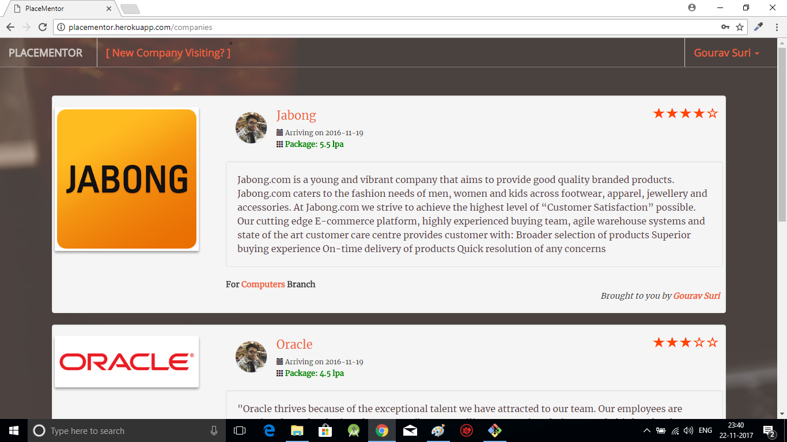
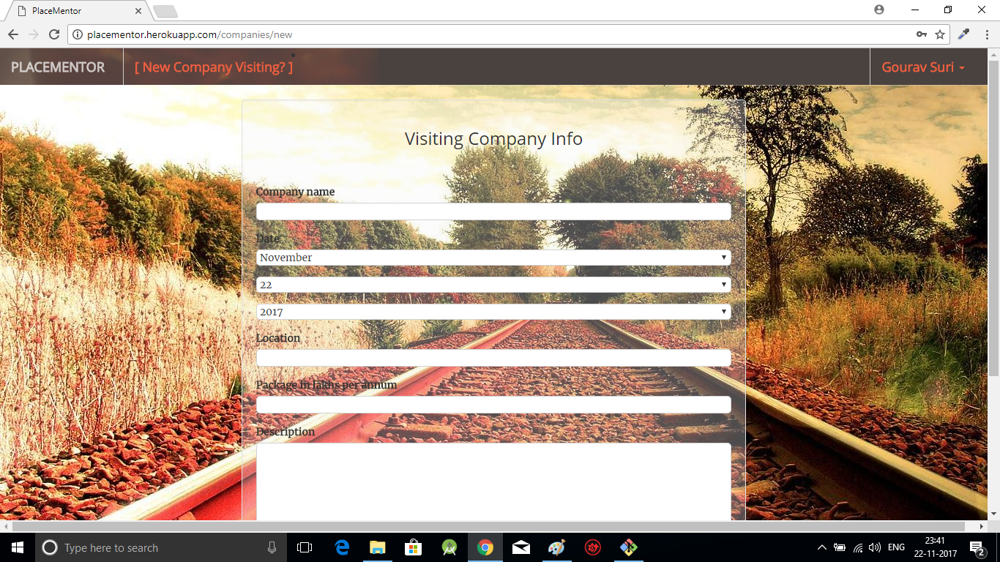
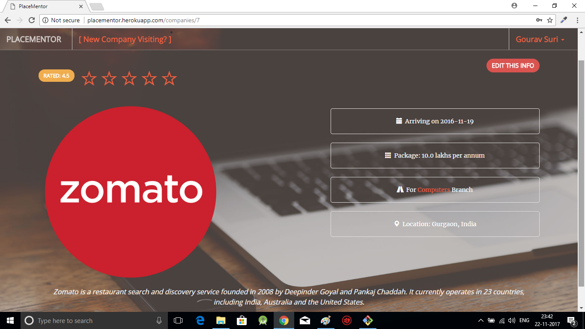
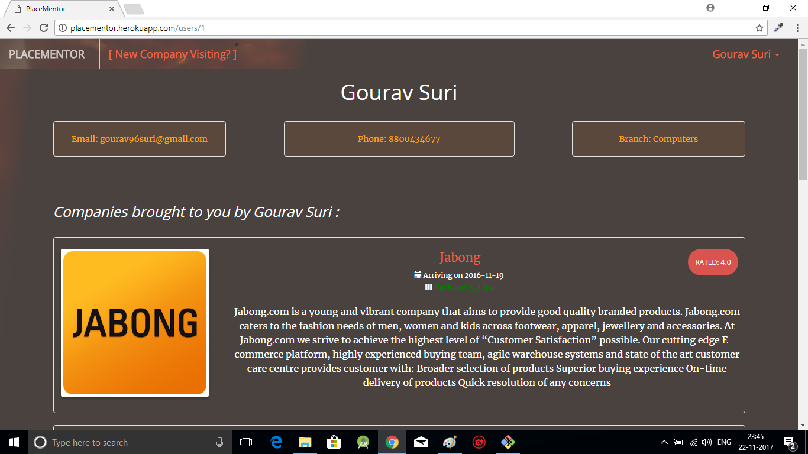
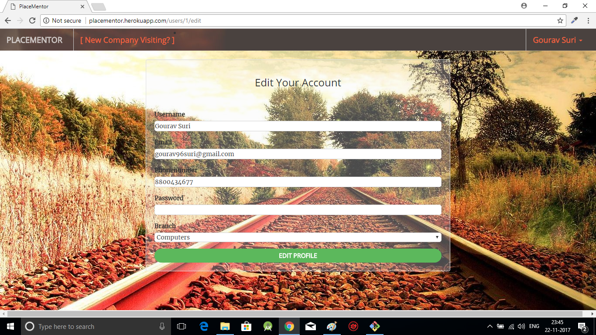
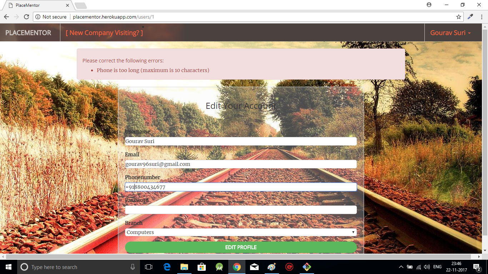

  
  
# PlaceMentor                                  
:mortar_board: PlaceMentor helps you to get information regarding Oncampus companies visit!  
Designed for Jamians only  
PlaceMentor is currently  hosting on [Heroku](http://placementor.herokuapp.com/)  
  
  
### Technologies used  
  
This website uses a number of open source projects to work properly:  

* Frontend
  * HTML/CSS
  * Bootstrap
  
* Backend
  * Ruby/Rails
  * AWS  
  
  
### Development  
  
Want to contribute? **:pencil:**  
  
To fix a bug or enhance an existing module, follow these steps:  
  
1. Fork the repo
2. Create a new branch (`git checkout -b exciting-stuff`)
3. Make the appropriate changes in the files
4. Add changes to reflect the changes made
5. Commit your changes (`git commit -am 'exciting-stuff!!'`)
6. Push to the branch (`git push origin exciting-stuff`)
7. Create a Pull Request
  
### Interested?  
  
If you find a bug (the website couldn't handle the query and / or gave irrelevant results), kindly open an issue [here](https://github.com/thegenuinegourav/PlaceMentor/issues/new) by including your search query and the expected result.  
  
If you'd like to request a new functionality, feel free to do so by opening an issue [here](https://github.com/thegenuinegourav/PlaceMentor/issues/new) including some sample queries and their corresponding results.  
  
### Screenshots
  
  
  
  
  
  
  
  
  
  
  
  
  
  
  
  
  
  
  
  
  

